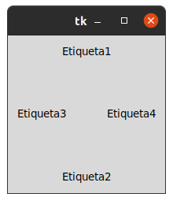
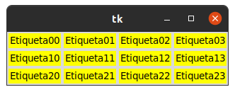

# 1. POSICIONAMIENTO Y DISEÑO

## Gestor de geometria pack

## Gestor de geometria grid

#### con grid la destribucion de los widgets se realiza de una manera mas flexible, utilizando un diseño cuadricula. De esta manera , cada widget en la celda determinada por la interseccion de una fila y una columna.

## Gestor de geometria place

### este gestor permite colocar los widgets en coordenadas especificas de la ventana principal o del widget contenedor.

