## 4. WIDGETS

## BUTTON
### ESTE PROGRAMA NOS AYUDA A CONTABILIZAR EL TIEMPO

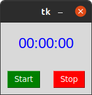

## ENTRY
### ESTE PROGRAMA AL ENTRAR NOS PIDE UN USUARIO Y UNA CONTRASEÑA

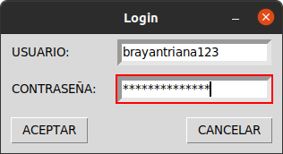

## LABEL RELOJ
### ESTE PROGRAMA NOS DA LA HORA EXACTA CON MINUTOS Y SEGUNDOS

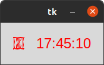

## LISTBOX
### EN ESTE PROGRAMA NOS AYUDA A TRADUCIR UNA PALABRA A CUALQUIERA DE LOS 4 IDIOMAS QUE APARECEN

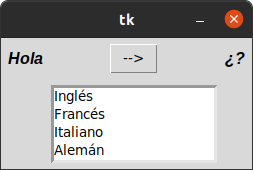

## MENU
### ES UN MENU PRINCIPAL QUE PUEDE AYUDAR PARA LA CREACION DE UNA APLICACION DE ESCRITORIO
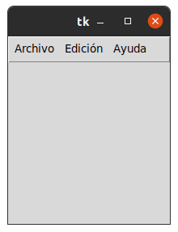

## MENUBUTTON
### EN ESTE PROGRAMA NOS PIDEN LLENAR EL FORMULARIO CON NOMBRE, DIRECCION, PROVINCIA, EDAD Y GENERO (SEXO)
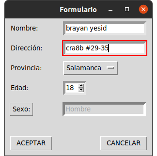

## MESSAGEBOX
### ESTE PROGRAMA NOS ABRE UN MENU CUANDO QUERAMOS VER EL MANUAL DE USARIO

## OPTION MENU
### EN ESTE PROGRAMA NOS PIDEN LLENAR EL FORMULARIO CON EL NOMBRE; DIRECCION, PROVINCIA Y EDAD

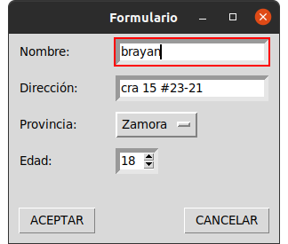

## SCALE ARCO
### ESTE PROGRAMA NOS AYUDA A SABER EXACTAMENTE EL ANGULO Y COMO SERIA ESE ANGULO
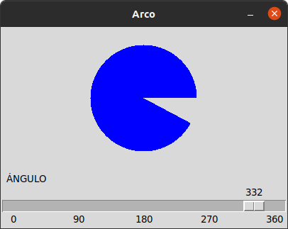

## SCROLL
###  ESTE PROGRAMA PERMITE ESCRIBIR CUALQUIER COSA Y GUARDARLA EN ALGUNA CARPETA
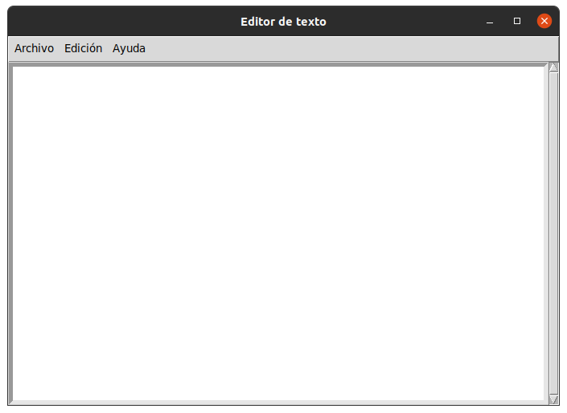

## SPIN BOX
### ESTE PROGRAMA NOS PIDE LLENAR ESTE FORMULARIO CON NOMBRE, DIRECCION Y EDAD
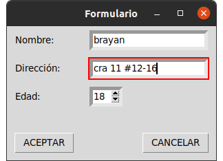

## TEXT
###  PERMITE ESCRIBIR CUALQUIER PALABRA O FRASE Y GUARDARLA EN UNA CARPETA

## TOP LEVEL
### ESTE PROGRAMA AL ENTRAR NOS APRACERE UN BOTON DE ACCEDER Y AL ACCEDER NOS APARECE UN LOGIN CON USUARIO Y CONTRASEÑA

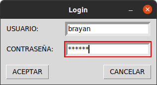