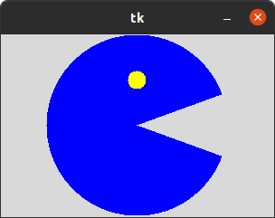
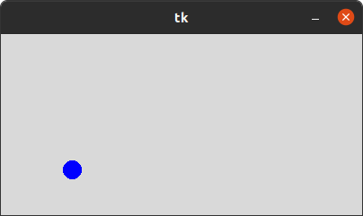
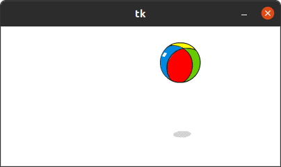
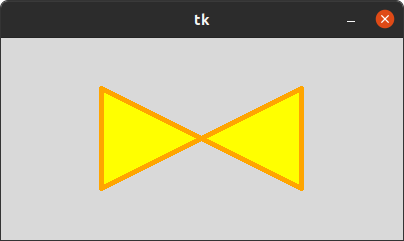
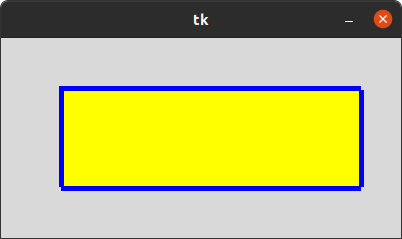
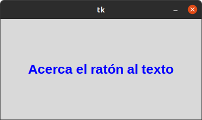
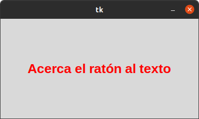
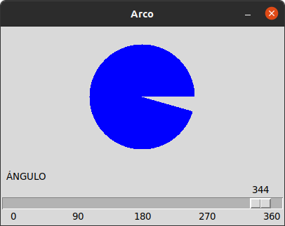

## 5. CANVA

## ARC
### EN ESTE PROGRAMA NOS ABRE UNA IMAGEN DE PACMAN QUE ABRE Y CIERRA LA BOCA

## CIRCULO
### EN ESTE PROGRAMA NOS MUESTRA UNA PELOTA QUE VA REBOTANDO PARA TODOS LOS LADOS DE LA PANTALLA

## IMAGEN
### EN ESTE PROGRAMA NOS MUESTRA UNA PELOTA DE PLAYA MOVIENDOSE PARA TODOS LOS LADOS DE LA PANTALLA

## LINEAS
### EN ESTE PROGRAMA NOS MUESTRA UNA CUADRICULA CON VARIAS LINEAS

## POLIGONO
### EN ESTE PROGRAMA NOS MUESTRA UNA IMAGEN DE UN POLIGONO EN LA PANTALLA DEL PROGRAMA

## RECTANGULO
### EN ESTE PROGRAMA NOS MUESTRA UNA IMAGEN DE UN RECTANGULO EN LA PANTALLA DEL PROGRAMA

## TEXT
### EN ESTE PROGRAMA NOS MUESTRA UNA FRASE DE COLOR MORADO Y AL ACERCAR EL CURSOR A LA PALABRA SE PONE DE COLOR ROJO

## ARCO
### EN ESTE PROGRAMA NOS PERMITE VER EL ANGULO Y NOS MUESTRA LA IMAGEN COMO QUEDARIA
