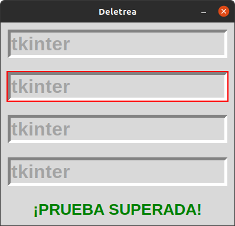
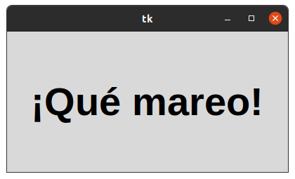
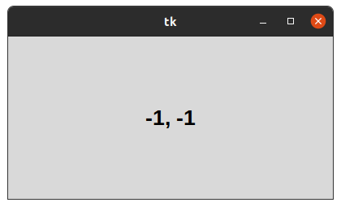

# 2. METODOS COMUNES

## DELETREO

### se trata de colocar la palabra tkinter en cada una de las casillas

## TEMPORIZADOR

### Este programa ayuda a agrandar la imagen y a miminizar la imagen o frase

## POSICION DE RATON 

### Este programa ayuda a saber la ubicacion exacta del cursor del raton

